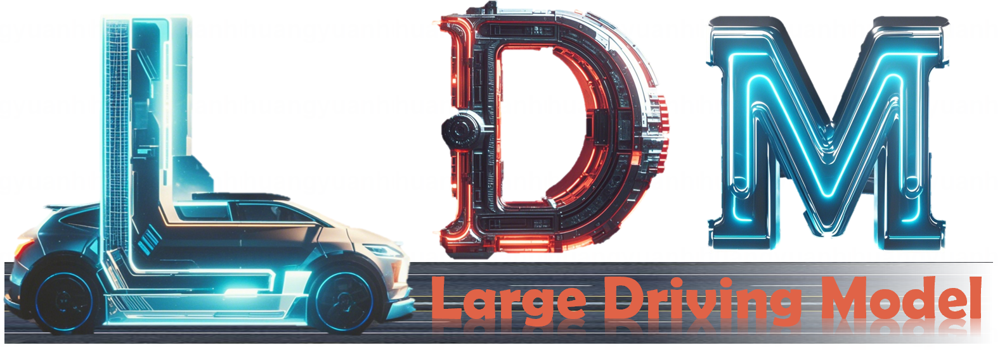
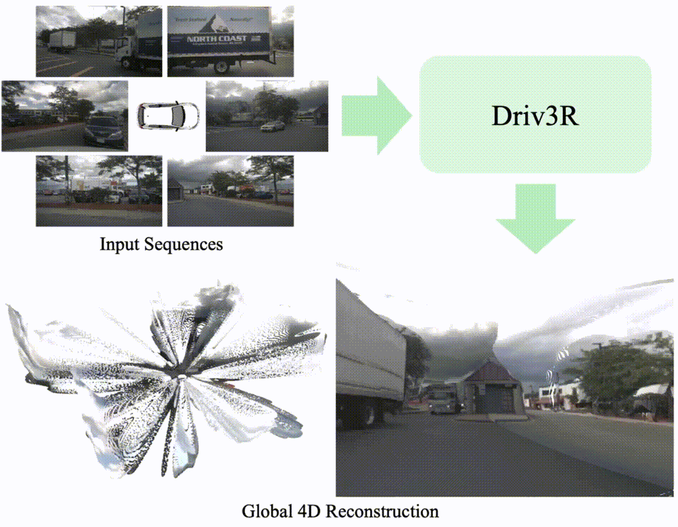

# Large Driving Models



While most existing methods focus on adapting driving tasks to pre-trained large language models or vision-language models, we design a series of large driving models specifically for autonomous driving.

## Model Zoo (Literally!)

| Model           | Release Data | Function                   | Task                                              | Why the name?                           | Core Contributor                               | Code                                    |
| --------------- | ------------ | -------------------------- | ------------------------------------------------- | --------------------------------------- | ---------------------------------------------- | --------------------------------------- |
| **Stereo Anything** | 2024/11/22   | Large Stereo Model         | Stereo-based Depth Estimation                     | Stereo Anything                         | [Xianda Guo](https://github.com/XiandaGuo)     | https://github.com/XiandaGuo/OpenStereo |
| **Stag-1**          | 2024/12/9    | Large Simulation Model     | 4D Photorealistic Simulation                      | Spatial-Temporal simulAtion for drivinG | [Lening Wang](https://github.com/LeningWang)   | https://github.com/wzzheng/Stag         |
| **Driv3R**          | 2024/12/10   | Large Reconstruction Model | Pose-free Dense Reconstruction                    | DRIVing 3d Reconstruction             | [Fei Xin](https://github.com/Barrybarry-Smith) | https://github.com/Barrybarry-Smith/Driv3R                                     |
| **GPD-1**         | 2024/12/12   | Latent World Model         | Close-Loop Simulation, Planning, Scene Generation |  Generative Pre-training for Driving      | [Zixun Xie](https://github.com/rainyNighti)     | https://github.com/wzzheng/GPD                            |
| **Doe-1**           | 2024/12/13   | Large World Model          | End-to-End Perception, Prediction, Planning       | TBD                                     | Zetian Xia                                     | TBD                                     |
| **DrivingRecon**    | 2024/12/13   | Large Gaussian Model       | Generalizable 4D Gaussian Reconstruction          | TBD                                     | [Hao Lu](https://github.com/LuPaoPao)          | TBD                                     |
| **Owl-1**           | 2024/12/16   | Video Generation Model     | End-to-End Planning and Generation                | TBD                                     | [Yuanhui Huang](https://huang-yh.github.io/)   | TBD                                     |

### Recent not so large models:

| Model            | Release Data | Task                               | Core Contributor                             | Code                                       |
| ---------------- | ------------ | ---------------------------------- | -------------------------------------------- | ------------------------------------------ |
| **EmbodiedOcc**      | 2024/12/6    | Embodied 3D Occupancy Prediction   | [Yuqi Wu](https://github.com/YkiWu)          | https://github.com/YkiWu/EmbodiedOcc       |
| **GaussianFormer-2** | 2024/12/6    | Multi-View 3D Occupancy Prediction | [Yuanhui Huang](https://huang-yh.github.io/) | https://github.com/huang-yh/GaussianFormer |
| **TBD**              | 2024/12/17   | Streaming 3D Occupancy Prediction  | [Sicheng Zuo](https://github.com/zuosc19)    | TBD                                        |

## Demos

### Stag-1 

#### Freeze Time


#### Freeze View 


#### Demo 3: Multi-View


### Driv3R



### DrivingRecon


### GPD-1


### Doe-1


### EmbodeidOcc


## Citations

If you find this project helpful, please consider citing the following papers:

```
### Stereo Anything
@article{guo2024stereo,
  title={Stereo Anything: Unifying Stereo Matching with Large-Scale Mixed Data},
  author={Guo, Xianda and Zhang, Chenming and Zhang, Youmin and Nie, Dujun and Wang, Ruilin and Zheng, Wenzhao and Poggi, Matteo and Chen, Long},
  journal={arXiv preprint arXiv:2411.14053},
  year={2024}
}

### Stag-1
@article{wang2024stag-1,
    title={Stag-1: Towards Realistic 4D Driving Simulation with Video Generation Model},
    author={Wang, Lening and Zheng, Wenzhao and Du, Dalong and Zhang, Yunpeng and Ren, Yilong and Jiang, Han and Cui, Zhiyong and Yu, Haiyang and Zhou, Jie and Lu, Jiwen and Zhang, Shanghang},
    journal={arXiv preprint arXiv:},
    year={2024}
	}
	
### EmbodiedOcc
@article{wu2024embodiedoccembodied3doccupancy,
      title={EmbodiedOcc: Embodied 3D Occupancy Prediction for Vision-based Online Scene Understanding}, 
      author={Yuqi Wu and Wenzhao Zheng and Sicheng Zuo and Yuanhui Huang and Jie Zhou and Jiwen Lu},
      journal={arXiv preprint arXiv:2412.04380},
      year={2024}
}

### GaussianFormer-2
@article{huang2024gaussianformer-2,
      title={GaussianFormer-2: Probabilistic Gaussian Superposition for Efficient 3D Occupancy Prediction}, 
      author={Yuanhui Huang and Amonnut Thammatadatrakoon and Wenzhao Zheng and Yunpeng Zhang and Dalong Du and Jiwen Lu},
      journal={arXiv preprint arXiv:2412.04384},
      year={2024}
}

### Driv3R
@article{driv3r,
  title={Driv3R: Learning Dense 4D Reconstruction for Autonomous Driving}, 
  author={Fei, Xin and Zheng, Wenzhao and Duan, Yueqi and Zhan, Wei and Tomizuka, Masayoshi and Keutzer, Kurt and Lu, Jiwen},
  journal={arXiv preprint arXiv:2412.06777},
  year={2024}
}

### GPD-1
  @article{gpd-1,
    title={GPD-1: Generative Pre-training for Driving},
    author={Xie, Zixun and Zuo, Sicheng and Zheng, Wenzhao and Zhang, Yunpeng and Du, Dalong and Zhou, Jie and Lu, Jiwen and Zhang, Shanghang},
    journal={arXiv preprint arXiv:2412.08643},
    year={2024}
}

```
